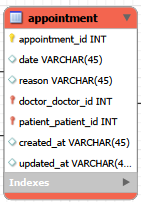
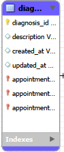
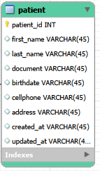
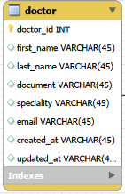
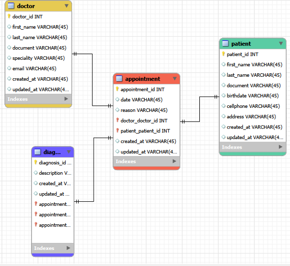

  

### Análisis y planificación del problema:
Comprende los requisitos del sistema que vas a modelar.
Define entidades principales, sus atributos y las relaciones entre ellas.
Asegura que el diseño inicial contemple reglas de normalización para evitar retrabajo.

### Diseño del modelo conceptual (DER) con normalización implícita:
Diseña un Diagrama Entidad–Relación (DER) aplicando desde el inicio los principios de normalización.
Identifica claves primarias, claves foráneas y tipos de relaciones entre entidades.
(Sugerencia operativa del entrenamiento) Puedes usar draw.io y exportar como imagen o PDF.

### Conversión al modelo relacional
Transforma el DER en un modelo relacional, garantizando correspondencia con el diagrama conceptual.
Especifica tipos de datos para cada campo de las tablas.
Exporta en imagen o PDF.

### Revisión de integridad y coherencia
Verifica equivalencia entre el DER y el modelo relacional.
Asegura que la normalización aplicada se mantenga en ambos (hasta 3FN).

