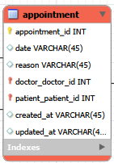
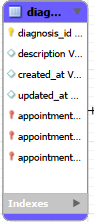
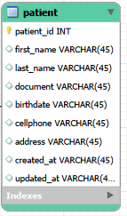
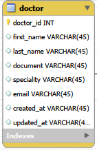
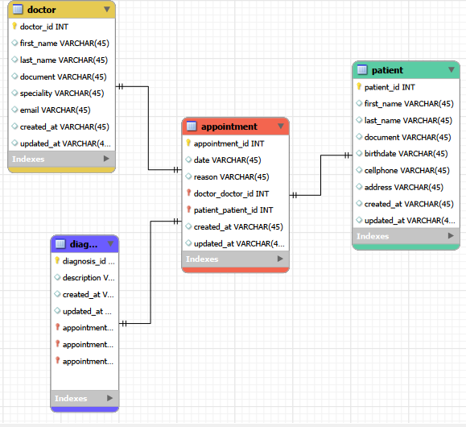

  

### Analysis and Planning of the Problem:

Understand the requirements of the system you are going to model.
Define main entities, their attributes and the relationships between them.
Ensure that the initial design considers normalization rules to avoid rework.

### Design of the Conceptual Model (ER) with Implicit Normalization:

Design an Entity-Relationship (ER) diagram applying normalization principles from the start.
Identify primary keys, foreign keys and types of relationships between entities.
(Operational training suggestion) You can use draw.io and export as an image or PDF.

### Conversion to the Relational Model

Transform the ER into a relational model, ensuring correspondence with the conceptual diagram.
Specify data types for each field of the tables.
Export as an image or PDF.

### Review of Integrity and Consistency

Verify equivalence between the ER and the relational model.
Ensure that the normalization applied is maintained in both (up to 3NF).
